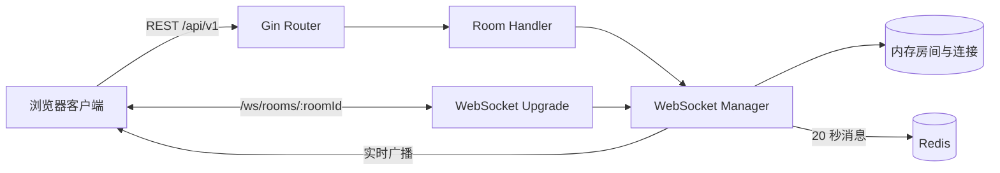

# Moment Chat 后端

Moment Chat 后端是一个使用 Go 构建的轻量级临时聊天室服务，提供房间创建与查询、在线成员管理、WebSocket 实时通信以及限时消息存储能力。

服务以 Gin 提供 HTTP API，使用 Gorilla WebSocket 维护实时连接，并通过 Redis 保存短生命周期消息。聊天消息默认在 20 秒后过期，适合临时讨论、短时协作和注重隐私的即时沟通场景。

## 功能特性

- 创建 6 位字母数字房间号，并查询房间状态与在线人数。
- 基于 WebSocket 实时广播文本消息、输入状态和成员进出事件。
- 消息写入 Redis，并设置 20 秒自动过期时间。
- 房间消息 ID 索引按房间保存，索引有效期为 24 小时。
- 房间与客户端集合使用读写锁保护，支持并发连接管理。
- 每个 WebSocket 客户端拥有独立发送队列和读写协程。
- 支持 Redis 密码认证与数据库编号配置。
- 提供健康检查、默认头像列表、CORS 和静态文件服务。
- 监听系统退出信号并执行 HTTP 服务优雅关闭。

## 技术栈

| 类别 | 技术 | 用途 |
| --- | --- | --- |
| 开发语言 | Go 1.23 | 服务端核心实现 |
| Web 框架 | Gin | 路由、中间件与 JSON API |
| 实时通信 | Gorilla WebSocket | HTTP 升级与双向消息传输 |
| 数据存储 | Redis / go-redis | 临时消息与房间消息索引 |
| 配置加载 | godotenv | 从 `.env` 加载本地配置 |
| 标识生成 | Google UUID | 客户端和消息唯一标识 |
| 测试 | Testify | 断言与测试套件 |

## 项目架构

```text
moment-chat-backend/
├─ internal/
│  ├─ config/
│  │  └─ config.go            # 环境变量加载与服务配置
│  ├─ handler/
│  │  └─ room.go              # 房间及默认头像 HTTP Handler
│  ├─ model/
│  │  └─ message.go           # 消息、用户、房间和 WS 消息模型
│  └─ server/
│     └─ server.go            # Gin、路由、中间件和服务生命周期
├─ pkg/
│  ├─ redis/
│  │  └─ client.go            # Redis 客户端初始化与连通性检查
│  └─ websocket/
│     └─ manager.go           # 房间、连接、广播和消息处理
├─ static/
│  └─ index.html              # 可由后端直接托管的静态页面
├─ test/
│  ├─ unit/                   # 单元测试
│  ├─ integration/            # API 与 WebSocket 集成测试
│  └─ e2e/                    # 完整业务流程测试
├─ main.go                    # 应用入口与优雅关闭
├─ run_tests.bat              # Windows 测试脚本
├─ run_tests.sh               # Unix 测试脚本
├─ go.mod
└─ .env                       # 本地运行配置，不应提交敏感信息
```

### 请求处理流程



## 核心实现

### 配置加载与服务启动

`internal/config` 使用 `godotenv` 加载项目根目录下的 `.env`，再通过环境变量覆盖默认值。应用入口完成以下流程：

1. 加载端口、Redis 和调试模式配置。
2. 初始化 Redis 客户端，并通过 `PING` 验证连接。
3. 创建 WebSocket 管理器和 Gin 路由。
4. 在独立 goroutine 中启动 HTTP 服务。
5. 监听 `SIGINT`、`SIGTERM`，收到信号后执行最长 5 秒的优雅关闭。

HTTP Server 配置了 10 秒读取超时、10 秒写入超时和 60 秒空闲超时。

### 房间管理

房间由 `pkg/websocket.Manager` 统一管理，当前保存在单个服务进程的内存中：

- `Manager.Rooms` 保存房间号到房间对象的映射。
- 每个 `Room` 使用客户端连接 ID 维护在线连接集合。
- `sync.RWMutex` 用于协调房间及连接集合的并发读写。
- HTTP API 创建的房间号由大小写字母和数字随机组成，长度固定为 6。
- WebSocket 连接指定的房间不存在时，服务端也会创建该房间。

由于房间状态位于内存中，服务重启后房间会丢失；多实例部署时，各实例之间也不会自动共享房间和在线成员状态。如需水平扩展，应进一步将房间状态迁移到共享存储，并通过 Redis Pub/Sub 等机制进行跨实例广播。

### WebSocket 连接生命周期

客户端访问 `/ws/rooms/:roomId` 后，服务端将 HTTP 连接升级为 WebSocket，并为连接生成 UUID。每个客户端包含：

- 一个 WebSocket 连接；
- 一个容量为 256 的发送通道；
- 一个读取协程，用于解析加入信息和后续消息；
- 一个写入协程，用于从发送通道向客户端推送消息。

连接建立后的第一条消息被视为加入房间信息。服务端解析用户资料、将客户端加入房间，并广播最新成员列表。连接关闭或读取失败后，客户端会从房间移除，同时广播离开事件。

广播采用发送通道分发数据，避免直接在业务处理路径中执行每个连接的网络写入。当客户端发送队列不可写时，该连接会被视为异常连接并清理。

### 消息与 Redis

收到 `text` 类型消息后，服务端会：

1. 生成消息 UUID，并补充房间、用户、头像和时间信息。
2. 设置 `expiresAt` 为当前时间之后 20 秒。
3. 将完整 JSON 消息写入 `message:{messageId}`，Redis TTL 为 20 秒。
4. 将消息 ID 写入 `room:messages:{roomId}` 列表，并为该列表设置 24 小时 TTL。
5. 包装为 `new_message` 事件并广播给房间内客户端。

Redis 键设计如下：

| Key | 类型 | 有效期 | 内容 |
| --- | --- | --- | --- |
| `message:{messageId}` | String / JSON | 20 秒 | 完整消息对象 |
| `room:messages:{roomId}` | List | 24 小时 | 对应房间的消息 ID |

当前实现只在消息写入时使用 Redis，实时广播和在线成员仍由进程内存负责。

## HTTP API

默认服务地址为 `http://localhost:8080`，业务接口统一使用 `/api/v1` 前缀。

| 方法 | 路径 | 说明 |
| --- | --- | --- |
| `GET` | `/ping` | 服务存活检查 |
| `GET` | `/api/v1/health` | API 健康检查与版本信息 |
| `POST` | `/api/v1/rooms` | 创建临时房间 |
| `GET` | `/api/v1/rooms/:roomId/check` | 检查房间是否存在 |
| `GET` | `/api/v1/rooms/:roomId/info` | 获取房间与在线人数 |
| `GET` | `/api/v1/avatars` | 获取默认头像列表 |
| `GET` | `/ws/rooms/:roomId` | 建立 WebSocket 连接 |

### 创建房间

```http
POST /api/v1/rooms
```

响应示例：

```json
{
  "roomId": "Ab3xY9",
  "createdAt": 1757059200,
  "message": "Room created successfully"
}
```

### 检查房间

```http
GET /api/v1/rooms/Ab3xY9/check
```

响应示例：

```json
{
  "exists": true,
  "roomId": "Ab3xY9"
}
```

房间号必须恰好为 6 位，且只能包含大小写字母和数字；格式错误时返回 `400 Bad Request`。

### 获取房间信息

```http
GET /api/v1/rooms/Ab3xY9/info
```

响应示例：

```json
{
  "roomId": "Ab3xY9",
  "userCount": 2
}
```

房间不存在时返回 `404 Not Found`。

## WebSocket 协议

连接地址：

```text
ws://localhost:8080/ws/rooms/{roomId}
```

### 加入房间

连接成功后，客户端发送的第一条消息应包含以下字段：

```json
{
  "username": "访客 001",
  "avatar": "https://api.dicebear.com/9.x/bottts-neutral/svg?seed=Jocelyn",
  "user_id": "user-001"
}
```

### 发送文本消息

```json
{
  "type": "text",
  "content": "你好，Moment Chat！"
}
```

服务端广播：

```json
{
  "type": "new_message",
  "payload": {
    "id": "f81d4fae-7dec-11d0-a765-00a0c91e6bf6",
    "roomId": "Ab3xY9",
    "userId": "user-001",
    "content": "你好，Moment Chat！",
    "type": "text",
    "timestamp": 1757059200000,
    "avatar": "https://api.dicebear.com/9.x/bottts-neutral/svg?seed=Jocelyn",
    "username": "访客 001",
    "expiresAt": 1757059220000
  }
}
```

### 发送输入状态

```json
{
  "type": "typing",
  "content": "start"
}
```

服务端广播的事件类型：

| 事件 | 说明 | 主要 Payload 字段 |
| --- | --- | --- |
| `new_message` | 新文本消息 | 完整消息对象 |
| `user_join` | 用户进入及成员列表更新 | `userId`、`username`、`avatar`、`userCount`、`userList` |
| `user_leave` | 用户离开 | `userId`、`userCount` |
| `user_typing` | 用户正在输入 | `userId`、`username` |

## 本地开发

### 环境要求

- Go 1.23 或兼容版本
- Redis 6 或更高版本
- Git

### 获取依赖

```sh
go mod download
```

### 配置环境变量

在项目根目录创建或修改 `.env`：

```dotenv
PORT=8080
REDIS_ADDR=localhost:6379
REDIS_PASSWORD=your_redis_password
REDIS_DB=0
DEBUG=true
```

| 变量 | 默认值 | 说明 |
| --- | --- | --- |
| `PORT` | `8080` | HTTP 与 WebSocket 服务端口 |
| `REDIS_ADDR` | `localhost:6379` | Redis 地址 |
| `REDIS_PASSWORD` | 空字符串 | Redis 密码；无认证时留空 |
| `REDIS_DB` | `0` | Redis 数据库编号 |
| `DEBUG` | `false` | 是否启用 Gin 调试模式 |

请勿将真实 Redis 密码提交到公开仓库。生产环境建议由部署平台注入环境变量，而不是使用仓库内的 `.env`。

### 启动服务

确保 Redis 已运行且密码配置一致，然后执行：

```sh
go run .
```

启动后可检查服务状态：

```sh
curl http://localhost:8080/ping
curl http://localhost:8080/api/v1/health
```

### 构建

```sh
go build -o moment-chat-backend .
```

Windows 可使用：

```powershell
go build -o moment-chat-backend.exe .
```

## 测试

单元测试需要可用的本地 Redis，测试默认使用数据库 `1`，请勿与重要数据共用该数据库。

```sh
# 单元测试
go test ./test/unit -v

# API 与 WebSocket 集成测试
go test ./test/integration -v

# 端到端测试
go test ./test/e2e -v
```

也可以运行平台脚本：

```sh
# Linux / macOS
chmod +x run_tests.sh
./run_tests.sh
```

```powershell
# Windows
.\run_tests.bat
```

## 部署注意事项

- 生产环境必须限制 WebSocket `Origin`，当前实现允许所有来源。
- 当前 CORS 配置允许任意来源，正式部署时应配置可信前端域名。
- 日志中不应输出密码或其他敏感配置。
- 反向代理需要正确转发 WebSocket 的 `Upgrade` 与 `Connection` 请求头。
- 多实例部署需要共享房间状态，并增加跨实例消息广播机制。
- 应为 Redis 配置访问控制、持久化策略、资源上限和监控告警。

## 相关项目

- [Moment Chat 前端](https://github.com/ylpxzx/moment-chat-frontend)

## 许可证

如需开源发布，请在仓库中补充明确的许可证文件与授权说明。
